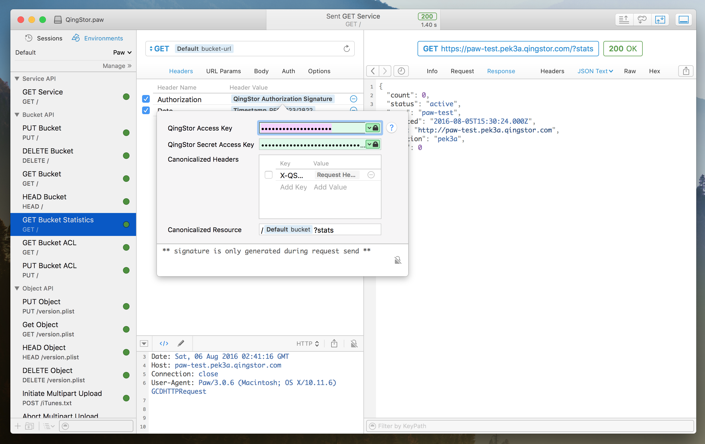

# Paw-QingStorAuthorizationSignatureDynamicValue
QingStor Authorisation Signature Dynamic Value Extension for [Paw](https://paw.cloud)


## About QingStor

[QingStor](https://docs.qingcloud.com/guide/object_storage.html) is an object storage service provided by [QingCloud](http://www.qingcloud.com/). It provides low-cost and reliable online storage service with unlimited storage space, high read and write performance, high reliability and data safety, fine-grained access control, and easy to use API.


## Screenshot




## Development

### Prerequisites

```shell
npm install
```

### Build

```shell
npm run build
```

### Install

```shell
make install
```


## ChangeLog

* v1.0.0 (2016-08-06)
  * QingStor Authorisation Signature Dynamic Value


Contributing
------------

1. Fork it ( https://github.com/prettyxw/Paw-QingStorAuthorizationSignatureDynamicValue/fork )
2. Create your feature branch (`git checkout -b my-new-feature`)
3. Commit your changes (`git commit -am 'Add some feature'`)
4. Push to the branch (`git push origin my-new-feature`)
5. Create a new Pull Request


LICENSE
-------
The MIT License.
